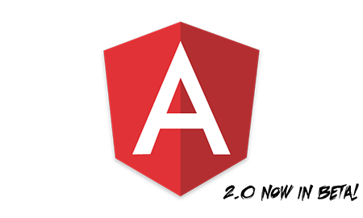

# Angular 2 Template-Syntax -- Beispiele

In diesem Verzeichnis finden Sie das im Artikel gezeigte Beispiel unter `src-simple/`.
Eine Weiterentwicklung dieser Demo steht für Sie im Ordner `src/` zur Verfügung.

## Setup & Start

Alle gezeigten Kommandozeilen-Befehle setzen voraus, dass [Node.js](https://nodejs.org/) installiert ist.

```cmd
$ npm install
$ npm install -g bower
$ bower install
$ npm start
```

Nach `npm start` öffnet sich der Standard-Browser und zeigt eine Auswahl an.

## Alle Beispiele der Fachartikelreihe

* [Teil 1 – Modularer Code mit SystemJS und jspm](https://github.com/Angular2Buch/angular2-module)
* __[Teil 2 – Templatesyntax und Web Components](https://github.com/Angular2Buch/angular2-template-syntax)__
* [Teil 3 – Dependency Injection und Unit-Testing](https://github.com/Angular2Buch/angular2-testing)
* [Teil 4 – Formularverarbeitung und Validierung](https://github.com/Angular2Buch/angular2-forms)
* [Teil 5 – Routing](https://github.com/Angular2Buch/angular2-routing) 